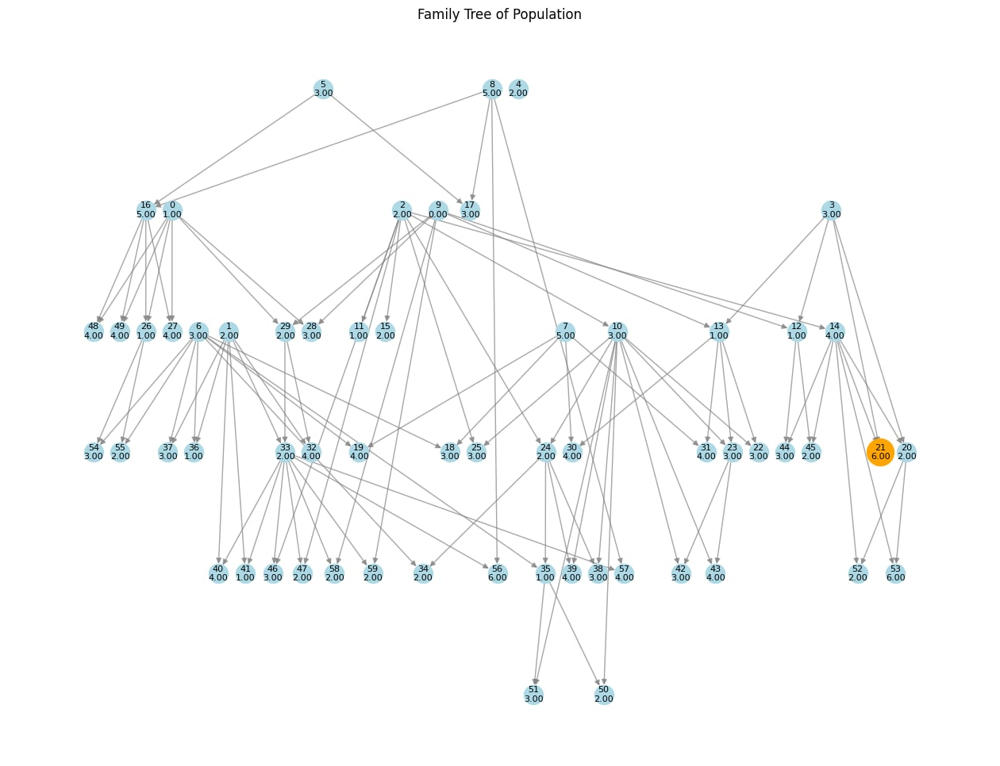

# Genetic Algorithm Lineage Visualizer

A Python library for visualizing the evolution of a genetic algorithm's population using a graph-based family tree. This module allows you to track individuals, their lineage (parental crossover), and mutations over multiple generations. It provides an easy-to-use interface for adding individuals and their relationships, as well as a visualization tool to view the family tree.

---

## Features

- **Track Population Lineage**: Add individuals, track their parents, and log mutation details.
- **Visualize Evolution Tree**: Generate a family tree graph of the population to see how individuals evolved over generations.
- **Highlight Best Individual**: Highlight the best-performing individual and trace its lineage back to the root.
- **Customizable Fitness Function**: Use your own fitness function to evaluate individuals.

---

## Installation

1. Clone this repository:

   ```bash
   git clone https://github.com/MemerGamer/GeneticAnalyzer.git
   cd GeneticAnalyzer
   ```

2. Install the required dependencies:

   ```bash
   cd analyzer
   pip install -r requirements.txt
   ```

   > **Note:** `pygraphviz` requires Graphviz to be installed on your system. Refer to the [Graphviz Installation Guide](https://pygraphviz.github.io/documentation/stable/install.html) for your platform.

---

## Usage

### Library: `analyzer.py`

The main library file defines the `GeneticAnalyzer` class, which provides methods for managing the population, tracking lineage, and visualizing the evolutionary tree.

#### Example

```python
from analyzer import GeneticAnalyzer

# Initialize the analyzer
analyzer = GeneticAnalyzer()

# Add individuals to the population
individual_1 = {"genes": [0, 1, 1, 0, 1], "fitness": 3.0}
individual_2 = {"genes": [1, 0, 0, 1, 1], "fitness": 2.5}
id_1 = analyzer.add_individual(individual_1)
id_2 = analyzer.add_individual(individual_2)

# Add a child through crossover and mutation
child = {"genes": [0, 1, 0, 1, 1], "fitness": 3.5}
analyzer.add_individual(child, parents=[id_1, id_2], mutation_info="Bit flip at index 2")

# Visualize the family tree
analyzer.visualize_tree(highlight_best=2)  # Highlight the child
```

---

### Test Script: `main.ipynb`

The `main.ipynb` file demonstrates the use of the library by simulating a simple genetic algorithm. It evolves a population of binary individuals to maximize their sum.

#### How It Works

1. **Initialization**:

   - A random population of binary individuals is created.
   - Each individual is evaluated using a simple fitness function: the sum of its binary values.

2. **Evolution**:

   - Over multiple generations, individuals are selected for reproduction based on their fitness.
   - Crossover and mutation create new individuals.
   - The lineage, including parent relationships and mutations, is logged in the analyzer.

3. **Visualization**:
   - At the end of the evolution, the family tree is visualized.
   - The best individual is highlighted, and its lineage is traced back to the root.

#### Run the Test

To run the test script with jupyter notebook.

#### Example Output

The script will print the fitness of each generation and display a graph showing the lineage of individuals. The graph will:

- Highlight the best-performing individual in orange.
- Trace the path from the root to the best individual in red (if it exists).

---

## Code Structure

- **`analyzer.py`**: Contains the `GeneticAnalyzer` class for managing the population and visualizing the lineage.
- **`main.ipynb`**: A test script that demonstrates the library's functionality with a simple genetic algorithm.

---

## Key Methods

### `GeneticAnalyzer` Class

| Method                                                         | Description                                                                                |
| -------------------------------------------------------------- | ------------------------------------------------------------------------------------------ |
| `add_individual(individual, parents=None, mutation_info=None)` | Adds an individual to the population. Tracks parent relationships and mutations.           |
| `visualize_tree(highlight_best=None)`                          | Visualizes the family tree of the population. Highlights the best individual if specified. |
| `_get_path_from_root(target)`                                  | Internal method to find the lineage path from the root to a specific individual.           |

---

## Visualization Example

The graph generated by `visualize_tree()` will look similar to the following structure:



- Nodes represent individuals, labeled with their fitness scores.
- Edges represent relationships (crossover or mutation).
- The best individual is highlighted in **orange**, and its path is traced in **red** (if it exists).

---

## Customization

You can modify the following parameters in the test script (`main.py`):

1. **Fitness Function**:
   Replace the `fitness_function()` with your own logic to evaluate individuals.

   ```python
   def fitness_function(individual):
       # Custom fitness function
       return sum(individual)
   ```

2. **Genetic Operators**:
   Adjust the `mutate()` and `crossover()` functions to use custom mutation or crossover mechanisms.

3. **Population Parameters**:
   Modify the size of the population, the number of generations, the mutation rate, and the individual size.

   ```python
   population_size = 10
   generations = 5
   individual_size = 6
   mutation_rate = 0.2
   ```

---

## Prerequisites

- Python 3.7 or higher
- Required Python Libraries:
  - `matplotlib`
  - `networkx`
  - `pygraphviz`
- **Graphviz**: Ensure that Graphviz is installed and available in your system path.

---

## Future Improvements

- Add support for different fitness visualization (e.g., plotting fitness over generations).
- Introduce additional graph layouts for better scalability with larger populations.
- Allow more customizable node/edge styles (e.g., color-coding based on fitness or mutation type).

---

## License

This project is licensed under the GPLv3 License. See the [LICENSE](./LICENSE) file for details.

---

## Author

Developed by Kovács Bálint-Hunor (MemerGamer). Contributions and suggestions are welcome!
